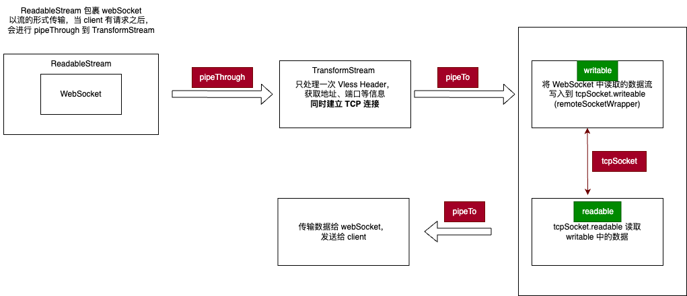

# 解析 Cloudflare 基于 websocket 使用 vless 代理的方式

1. 客户端先发送一个看似正常的 HTTP 请求，但在头部携带 `Upgrade: websocket` 等相关头字段，表示想要升级到 WebSocket 协议
2. 服务端检测到 Upgrade 标头后，调用 vlessOverWSHandler 函数处理这个 WebSocket 连接请求（[Cloudlfare 中使用 WebSocket 连接](https://developers.cloudflare.com/workers/runtime-apis/websockets/#constructor)）
3. 关于 `sec-websocket-protocol` 标头的疑惑：该标头原始是用来表示服务端支持的子协议，但是在 vless 中被用于承载 early data，查看[该 PR](https://github.com/XTLS/Xray-core/pull/375)。实际上为了达到 0-RTT 将首个 payload 放到该标头的行为，大部分客户端并没有实现，活着 1RTT 的延时并没有什么影响。
4. 有一个 Cloudflare 的 bug 就是使用 `WritableStreamDefaultController` 的 error 方法没有办法关闭流的写入，其实应该是可以的：详情请看[该文档](https://streams.spec.whatwg.org/#ref-for-ws-default-controller-error%E2%91%A0)。

各种参考：<https://www.cnblogs.com/huaglicg/p/10422919.html>、<https://sekai.icu/posts/design-issues-in-the-vless-protocol/>、<https://xtls.github.io/development/protocols/vless.html#request-response>
